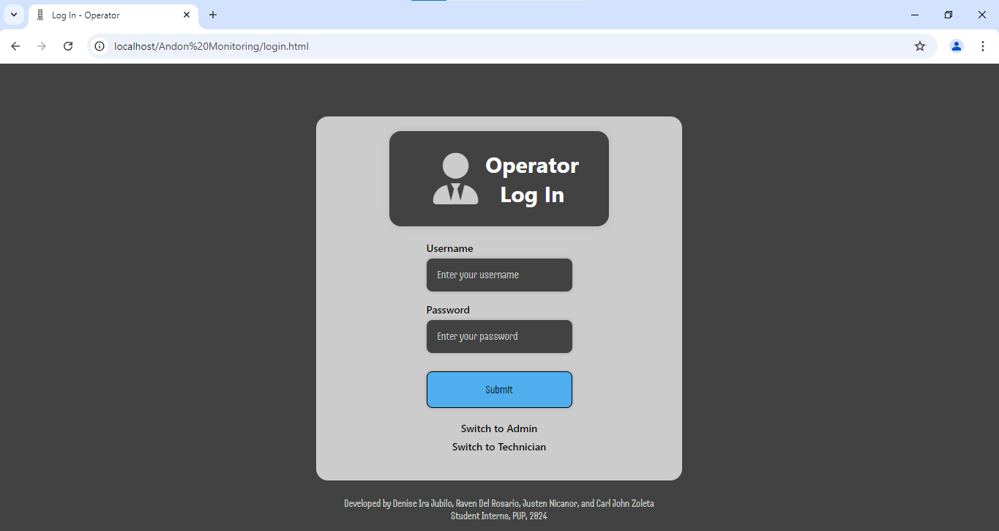
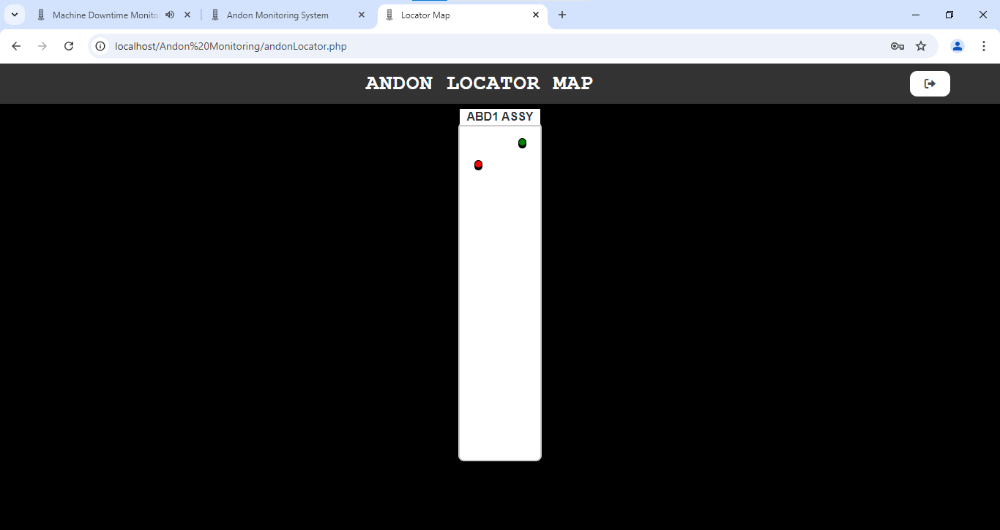
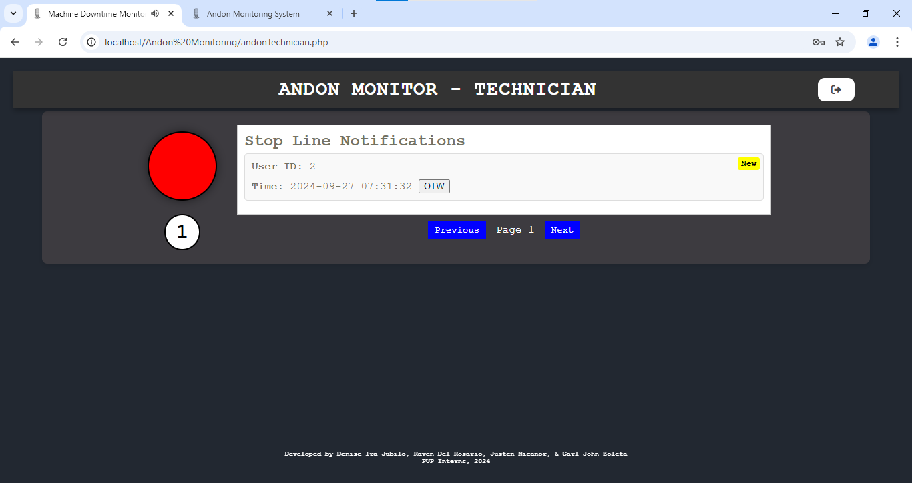
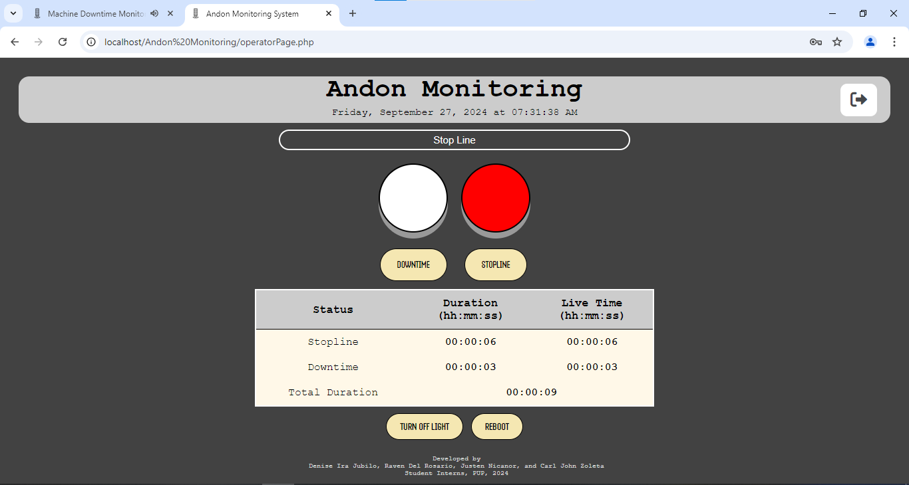

# 🛠️ Andon Monitoring System

The **Andon Monitoring System** is a local web-based tool designed to streamline machine downtime management and technical support in industrial environments. It includes three distinct portals for **Operators**, **Technicians**, and **Admins**, each tailored to their specific roles.

## 🌐 Portal Overview

- 👷 **Operator Portal**: Allows operators to quickly raise alerts when issues occur.
- 🧑‍🔧 **Technician Portal**: Enables technicians to view and respond to support requests in real-time.
- 🧑‍💼 **Admin Portal**: Provides admins with an Andon locator map to monitor downtime events and system usage across the facility.

---

## 🗃️ Database Setup (Using XAMPP)

### 📌 Prerequisites

- [XAMPP](https://www.apachefriends.org/index.html) installed
- Apache and MySQL running
- phpMyAdmin access via `http://localhost/phpmyadmin/`

---


## 🚀 Accessing the Website Locally

Once your project is set up and placed inside the htdocs folder of XAMPP:

Start Apache and MySQL via the XAMPP control panel.

 - Once your project is set up and placed inside the htdocs folder of XAMPP:
 - Start Apache and MySQL via the XAMPP control panel.
 - Open your browser.

Visit the technician login page at:

http://localhost/Andon%20Monitoring/login_tech.html

---

# 👨‍💻 Technologies Used
  - Frontend: HTML, CSS, JavaScript
  - Backend: PHP
  - Database: MySQL (via XAMPP)
  - Local Server: Apache (XAMPP)

---


### 🔧 Step 1: Create the Database

1. Open phpMyAdmin.
2. Create a new database (e.g., `andon_db`).
3. Click **Create**.

---

#### 🔧 Step 2: Create Required Tables

You should also create the following tables to manage user accounts:
 - monitoring_system_admin – contains admin user credentials
 - monitoring_system_tech – contains technician user credentials


```sql
CREATE TABLE `data` (
  `id` int(11) NOT NULL AUTO_INCREMENT,
  `user_id` int(11) NOT NULL,
  `red_duration` varchar(8) NOT NULL,
  `orange_duration` varchar(8) NOT NULL,
  `date_time` datetime NOT NULL,
  `combined_duration` varchar(8) NOT NULL,
  `status` varchar(255) NOT NULL,
  PRIMARY KEY (`id`)
) ENGINE=InnoDB DEFAULT CHARSET=utf8mb4 COLLATE=utf8mb4_general_ci;
```

Add a table for users (monitoring_system,monitoring_system_admin, monitoring_system_tech :

```sql
INSERT INTO users (username, password, data) 
VALUES ('newuser', MD5('newpassword123'), 'Some extra info');
```

### 📸 Project Preview

Below is a screenshot of the Material Monitoring System interface:







